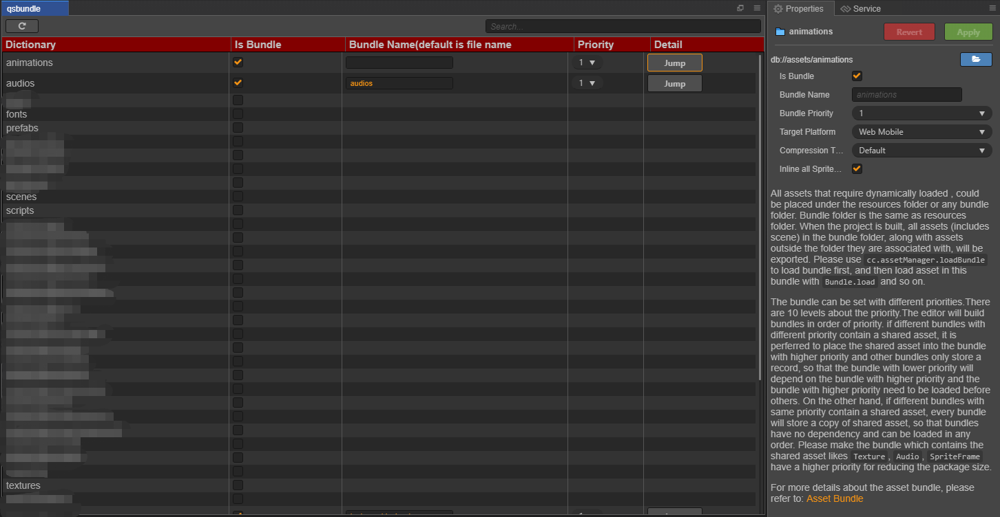

# qsbundle

## 一个bundle配置信息快速查看修改插件
---
- author : lqs
- email : 1053128593@qq.com
- license : MIT
---
插件界面：

---
### 需要注意的是设置为bundle包后其子目录会自动取消为bundle设置,因为目前是不支持bundle包嵌套的如果父目录与子孙目录同时设置为bundle包则构建会失败

---
   
      
      
### 如果觉得有用的话,也可以支持一波:pray:

